# JymBocala_T2A2

## Eat The Frog App

### Table of Contents
+ [**R1 - Identification of the problem you are trying to solve by building this particular app.**](#r1) 
+ [**R2 - Why is it a problem that needs solving?**](#r2) 
+ [**R3 - Why have you chosen this database system. What are the drawbacks compared to others?**](#r3) 
+ [**R4 - Identify and discuss the key functionalities and benefits of an ORM. Why use SQLAlchemy?**](#r4) 
+ [**R5 - Document all endpoints for your API?**](#r5) 
+ [**R6 - An ERD for your app**](#r6) 
+ [**R7 - Detail any third-party services that your app will use.**](#r7) 
+ [**R8 - Describe your project's models in terms of the relationships they have with each other.**](#r8) 
  - [User Model:](#user-model) 
  - [Task Model:](#task-model) 
  - [Follows Model:](#follows-model) 
+ [**R9 - Discuss the database relations to be implemented in your application.**](#r9) 
+ [**R10 - Describe the way tasks are allocated and tracked in your project.**](#r10) 
  - [GitHub Projects](#github-projects) 
  - [Daily stand-ups](#daily-stand-ups) 
  - [GitHub Repo Commits](#github-repo-commits)

---

### **R1 - Identification of the problem you are trying to solve by building this particular app.** <a id="r1"></a>

I am developing this app to address the common issue of procrastination, a significant obstacle to productivity. The primary challenge many individuals face is the lack of prioritization and feeling overwhelmed by numerous tasks. This app is inspired by Brian Tracy's philosophy outlined in his book "Eat That Frog!", the app aims to guide users in tackling their most challenging task each day, using the metaphor of "eating a frog" as a representation of overcoming difficulties.

---

### **R2 - Why is it a problem that needs solving?** <a id="r2"></a>

Compared to traditional to-do apps, this app's focus is on cultivating the habit of completing the most challenging task daily. To emphasize this, users are restricted to creating only one crucial task per day. Additionally, the app incorporates social interaction features, allowing users to follow each other and includes gamification elements to enhance user engagement. The intent is to create a supportive and motivating environment, encouraging users to consistently confront and conquer their daily challenges. The problem it addresses is the lack of an effective tool that specifically target the highest priority task for a user and provide a structured approach to task management while fostering a sense of community and motivation among users.

---

### **R3 - Why have you chosen this database system. What are the drawbacks compared to others?** <a id="r3"></a>

I have chose PostgreSQL for my application for a number of reasons:

- **Reliability:** PostgreSQL is renowned for its reliability. Its track record in handling complex transactions and ensuring data integrity makes it a suitable choice for applications where data accuracy is paramount.

- **ACID Compliance:** The ACID (Atomicity, Consistency, Isolation, Durability) properties of PostgreSQL contribute to the database's reliability and resilience. This ensures that even in the face of system failures or unexpected events, our app's data remains consistent and secure.

- **Extensibility:** PostgreSQL's extensibility allows us to customize and extend its functionality based on my app's specific needs. This flexibility ensures that the database can evolve with the growth and changing requirements when further developing the app.

- **Active Community Support:** The PostgreSQL community provides a wealth of resources, including documentation, and forums. This support structure is invaluable for addressing developent blockers, and industry best practices.

However, there are some drawbacks:

- **Learning Curve:** PostgreSQL may pose a steeper learning curve, especially for beginners or those unfamiliar with relational database management systems. However, long-term benefits justify the initial effort to learn PostgreSQL.

- **Horizontal Scalability Challenges:** While PostgreSQL excels in many scenarios, extreme horizontal scalability might present challenges compared to some NoSQL databases designed for massive, distributed systems. Alternative database systems may offer more straightforward solutions.

Sources:
https://docs.digitalocean.com/glossary/acid/#:~:text=state%20ensuring%20durability.-,PostgreSQL,order%20to%20keep%20data%20consistent.
https://onesignal.com/blog/lessons-learned-from-5-years-of-scaling-postgresql/
https://www.guru99.com/introduction-postgresql.html

---

### **R4 - Identify and discuss the key functionalities and benefits of an ORM. Why use SQLAlchemy?** <a id="r4"></a>

In my project, SQLAlchemy serves as a valuable Object-Relational Mapping (ORM) tool, facilitating smooth communication between my code and the database. It offers several benefits that enhance my development experience:

- **Simplified Database Interactions:** With SQLAlchemy, I can interact with the database using Python objects, eliminating the need for complicated SQL details and promoting a more straightforward approach to coding. For example, when creating a new task in my app, I use SQLAlchemy to insert a new record into the "tasks" table without delving into complex SQL syntax.

- **Development Efficiency:** SQLAlchemy significantly enhances my development efficiency by providing a layer over SQL. This abstraction simplifies the process of querying and manipulating data, saving development time. For instance, when retrieving a user's tasks, I use SQLAlchemy to construct queries that fetch the relevant data efficiently.

- **Compatibility:** My app relies on PostgreSQL as the database system, and SQLAlchemy ensures compatibility, allowing me to seamlessly work with PostgreSQL features. This is evident in the way I define foreign key relationships, such as associating tasks with users.

In essence, SQLAlchemy is a pragmatic choice for my project, offering a simplified approach to database interactions and contributing to a more efficient development workflow.

---

### **R5 - Document all endpoints for your API?** <a id="r5"></a>

### **User Routes**

#### **1. /register**

- **HTTP Request Verb:** POST

- **Required data:** name, email, password

- **Expected response:** Expected '201 CREATED' response with return of data excluding password and is_admin.

- **Functionality:** Allows user to register. This information is stored in the database.

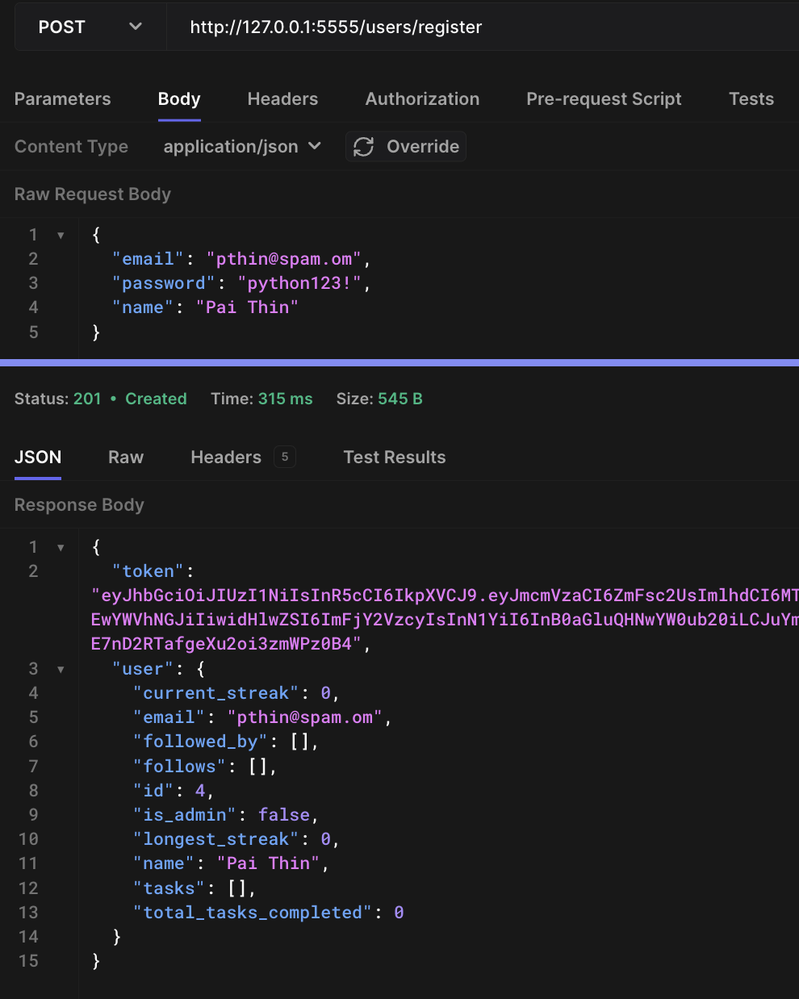

---

#### **2. /login**

- **HTTP Request Verb:** POST

- **Required Data:** email, password

- **Expected Response:** Expected '200 OK' response with a JWT token and user information excluding password and tasks.

- **Functionality:** Allows user to log in. If credentials are correct, a JWT token is created and returned along with user information.

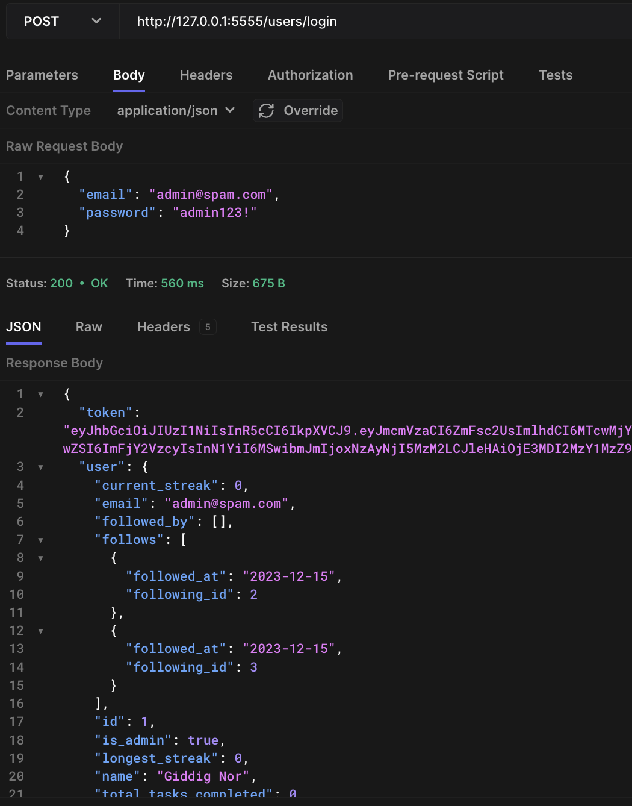

---

#### **3. /users**

- **HTTP Request Verb:** GET

- **Required Data:** None

- **Expected Response:** Expected '200 OK' response with a list of user information excluding password.

- **Authentication Methods:** Requires a valid JWT token for authentication.

- **Functionality:** Retrieves a list of all users. Only accessible by admin users.

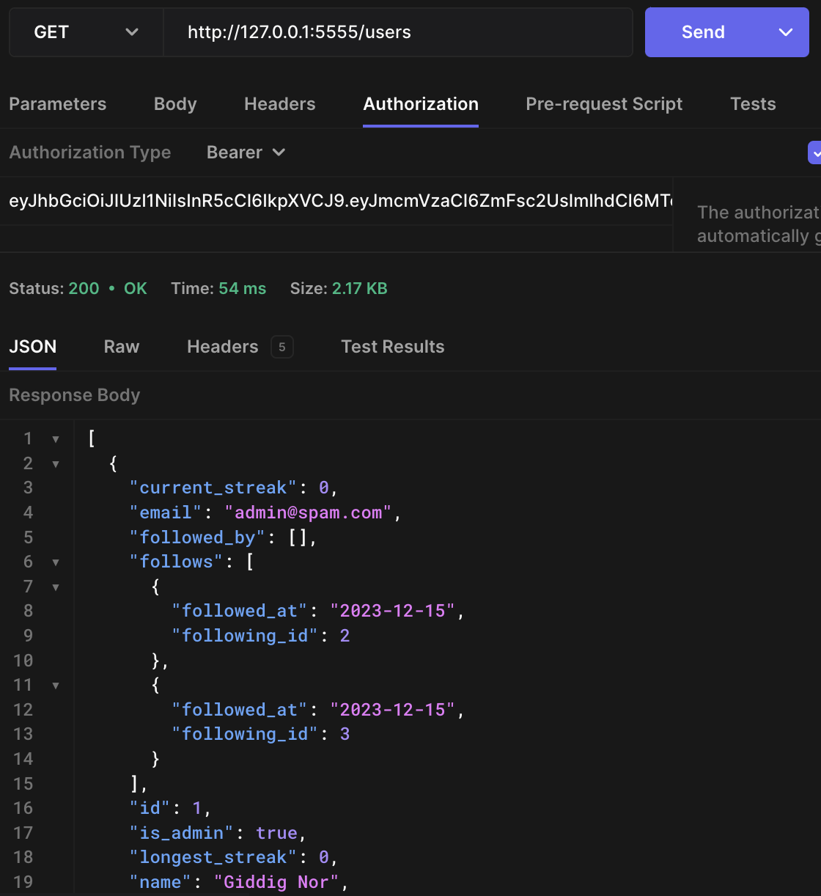

---

#### **4. /users/<int:id>**

- **HTTP Request Verb:** DELETE

- **Required Data:** None

- **Expected Response:** Expected '200 OK' response if the user is successfully deleted. '404 Not Found' if the user does not exist.

- **Authentication Methods:** Requires a valid JWT token for authentication. Admin access is also checked.

- **Functionality:** Deletes a user with the specified ID.

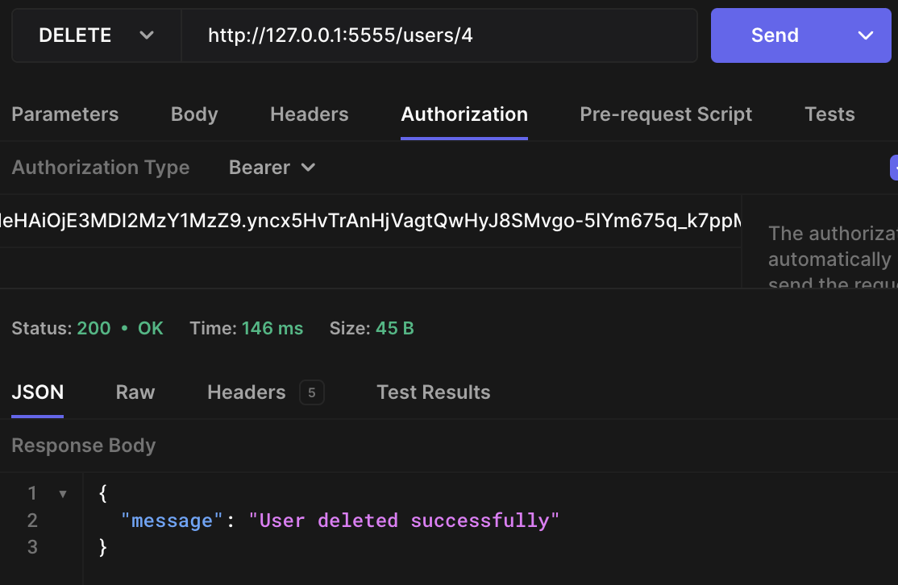

---

#### **5. /users/<int:id>/make-admin**

- **HTTP Request Verb:** PATCH

- **Required Data:** None

- **Expected Response:** Expected '200 OK' response if the user is successfully updated to admin. '404 Not Found' if the user does not exist.

- **Authentication Methods:** Requires a valid JWT token for authentication. Admin access is also checked.

- **Functionality:** Updates a user with the specified ID to admin status.

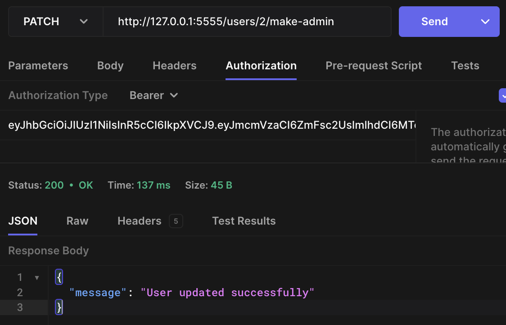

---

#### **6. /users/<int:id>/remove-admin**

- **HTTP Request Verb:** PATCH

- **Required Data:** None

- **Expected Response:** Expected '200 OK' response if the user's admin privileges are successfully removed. '404 Not Found' if the user does not exist.

- **Authentication Methods:** Requires a valid JWT token for authentication. Admin access is also checked.

- **Functionality:** Removes admin privileges from a user with the specified ID.


---

### **Task Routes**

#### **7. /tasks/**

- **HTTP Request Verb:** GET

- **Required Data:** None

- **Expected Response:** Expected '200 OK' response with a list of tasks belonging to the current user. The response includes task details excluding nested user information.

- **Authentication Methods:** Requires a valid JWT token for authentication.

- **Functionality:** Retrieves all tasks for the current user.

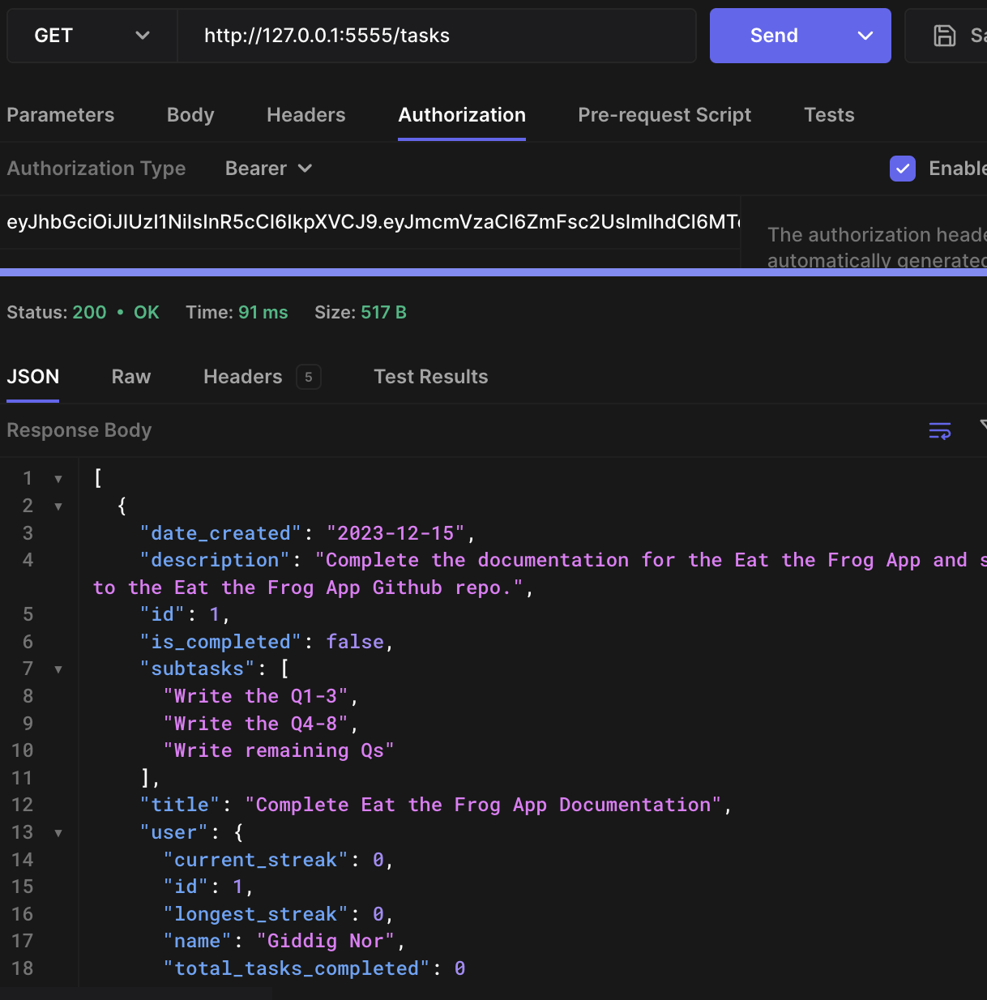

---

#### **8. /tasks/{id}**

- **HTTP Request Verb:** GET

- **Required Data:** Task ID in the URL

- **Expected Response:** Expected '200 OK' response with details of the specified task. The response includes nested user information with specified fields (id, name).

- **Authentication Methods:** Requires a valid JWT token for authentication.

- **Functionality:** Retrieves details of a specific task for the current user.

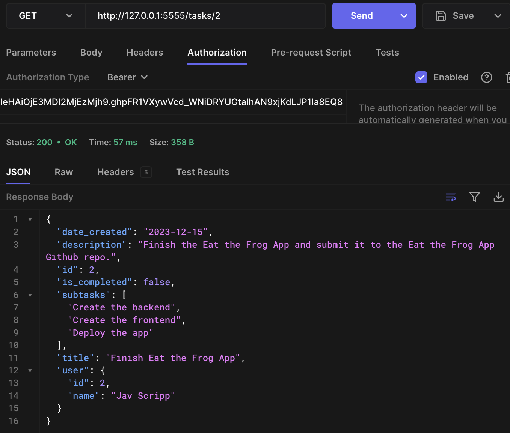

---

#### **9. /tasks**

- **HTTP Request Verb:** POST

- **Required Data:** Task information in the request body (title, description, subtasks - optional)

- **Expected Response:** Expected '201 CREATED' response with details of the newly created task. The response excludes nested user information.

- **Authentication Methods:** Requires a valid JWT token for authentication.

- **Functionality:** Creates a new task for the current user, ensuring only one task is created per day.

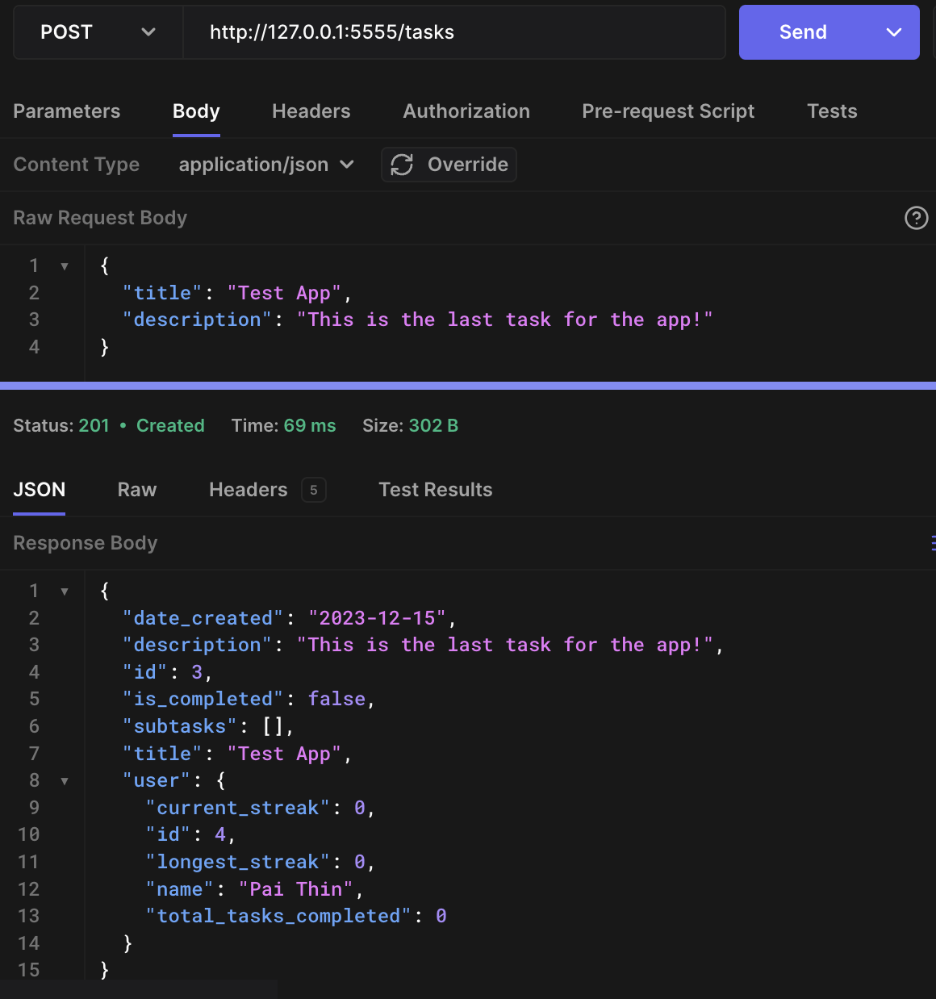

---

#### **10. /tasks/<int:id>**

- **HTTP Request Verb:** PUT, PATCH

- **Required Data:** Task information in the request body (title, description, subtasks, is_completed - optional)

- **Expected Response:** Expected '200 OK' response with the updated details of the task. The response excludes nested user information.

- **Authentication Methods:** Requires a valid JWT token for authentication.

- **Functionality:** Updates the specified task with the new information from the request body.

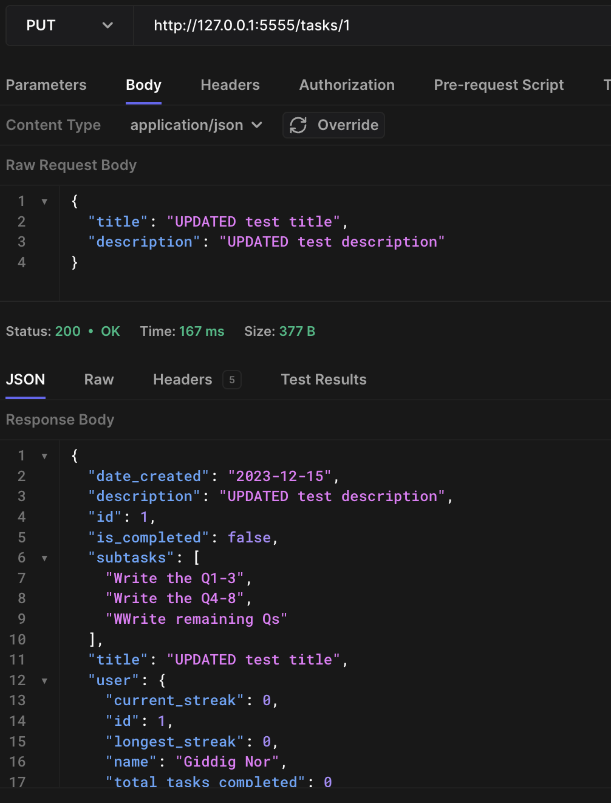

---

#### **11. /tasks/<int:id>**

- **HTTP Request Verb:** DELETE

- **Required Data:** None

- **Expected Response:** Expected '200 OK' response with a message indicating the successful deletion of the task.

- **Authentication Methods:** Requires a valid JWT token for authentication.

- **Functionality:** Deletes the specified task.

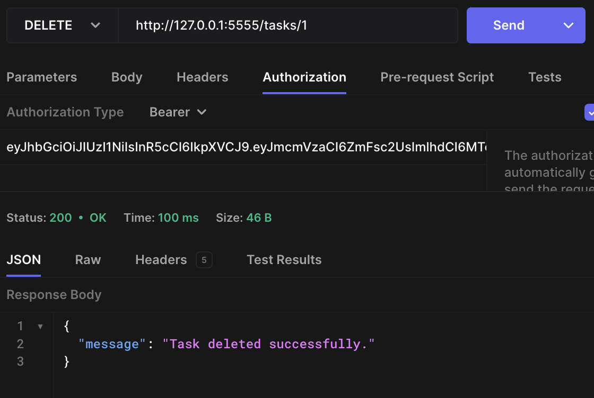

---

### **Follows Routes**

#### **12. /users/<int:user_id>/follow**

- **HTTP Request Verb:** POST

- **Required Data:** None

- **Expected Response:** Expected '200 OK' response with a message indicating the successful follow action.

- **Authentication Methods:** Requires a valid JWT token for authentication.

- **Functionality:** Follows the specified user.


---

#### **13. /users/<int:user_id>/unfollow**

- **HTTP Request Verb:** POST

- **Required Data:** None

- **Expected Response:** Expected '200 OK' response with a message indicating the successful unfollow action.

- **Authentication Methods:** Requires a valid JWT token for authentication.

- **Functionality:** Unfollows the specified user.

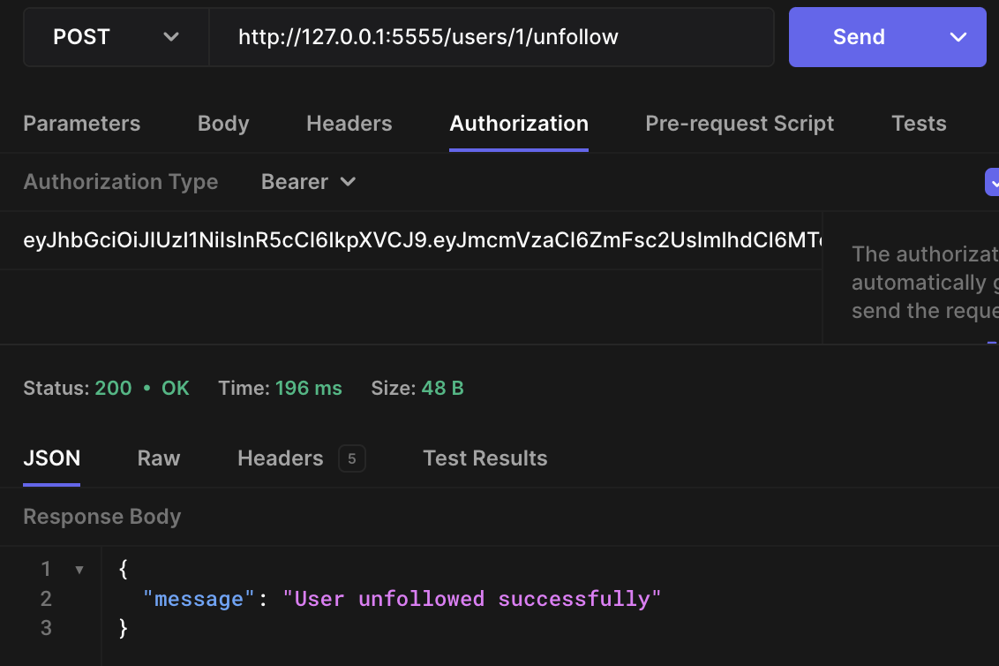

---

#### **14. /users/<int:user_id>/followers**

- **HTTP Request Verb:** GET

- **Required Data:** None

- **Expected Response:** Expected '200 OK' response with the total number of followers and a list of followers (containing follower_id and name).

- **Authentication Methods:** Requires a valid JWT token for authentication.

- **Functionality:** Retrieves the list of followers for the specified user.

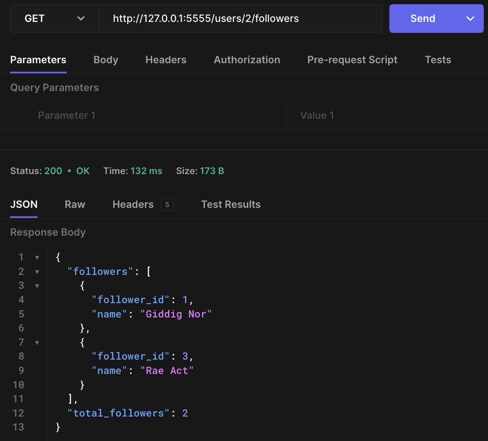

---

#### **15. /users/<int:user_id>/following**

- **HTTP Request Verb:** GET

- **Required Data:** None

- **Expected Response:** Expected '200 OK' response with the total number of users being followed and a list of users being followed (containing following_id and name).

- **Authentication Methods:** Requires a valid JWT token for authentication.

- **Functionality:** Retrieves the list of users that the specified user is following.

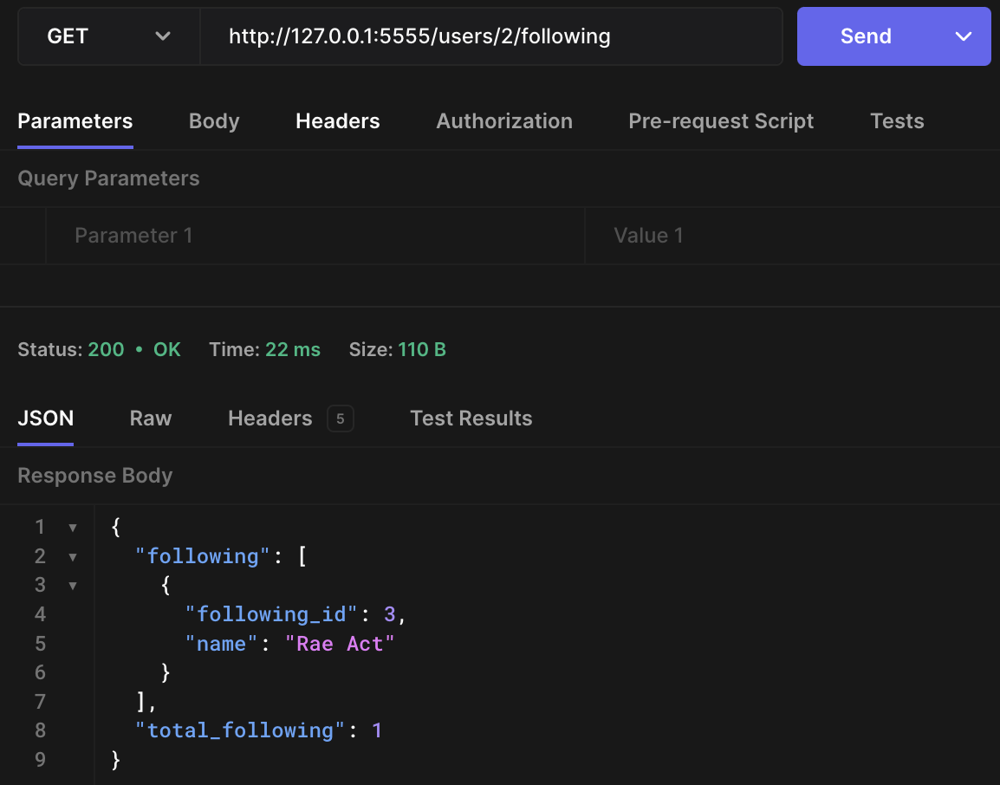

---

### **R6 - An ERD for your app** <a id="r6"></a>

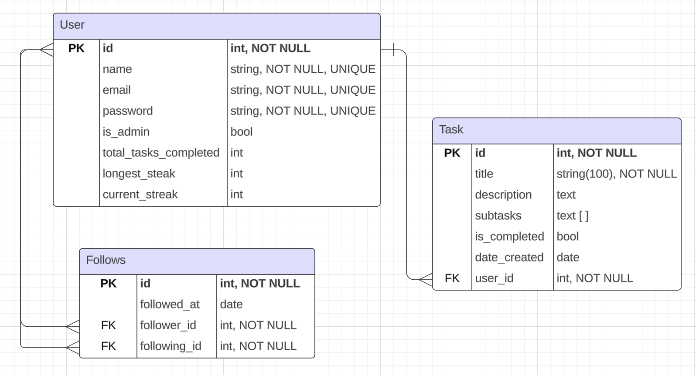

---

### **R7 - Detail any third-party services that your app will use.** <a id="r7"></a>

#### Flask:

I use Flask to create different parts of my app, like routes, where I decide what happens when someone makes a request.

#### SQL Alchemy:

I rely on SQL Alchemy to talk to my database in a way that's easy for Python to understand. It acts like a translator, making sure my app and the database can communicate without any barriers.

#### PostgreSQL:

PostgreSQL is my database, the place where I store all the important information for my app. It serves as a super-smart, organized filing cabinet, keeping everything in order for quick access.

#### Marshmallow:

Marshmallow is my go-to tool for converting complex things, like Python objects, into a format that I can easily share with others, like JSON.

#### Psycopg2:

Psycopg2 is my delivery person between my app and the PostgreSQL database. It ensures that when my app wants to talk to the database, the message gets there safe and sound.

#### Bcrypt:

I use Bcrypt is used to hash passwords. It takes the passwords my users create, turns them into a string of generated characters, and stores them safely.

#### JWT Manager:

JWT Manager is used when someone logs in, they are given special token. This token lets them access certain parts of my app without having to log in every time. JWT Manager helps me create and check these tokens.

---

### **R8 - Describe your project's models in terms of the relationships they have with each other.** <a id="r8"></a>

#### User Model:

The User model represents the core entity of my app, encapsulating user-related data such as name, email, and password. It also includes attributes for tracking user statistics like completed tasks, streaks, and admin status. The model establishes a one-to-many relationship with the Task model, allowing each user to have multiple associated tasks. Additionally, it features a many-to-many relationship through the Follows model, enabling users to follow and be followed by other users, fostering a social aspect within the application.

```python
class User(db.Model):
    __tablename__ = 'users'

    id = db.Column(db.Integer, primary_key=True)

    name = db.Column(db.String, nullable=False)
    email = db.Column(db.String, nullable=False, unique=True)
    password = db.Column(db.String, nullable=False)
    is_admin = db.Column(db.Boolean, default=False)
    total_tasks_completed = db.Column(db.Integer, default=0)
    longest_streak = db.Column(db.Integer, default=0)
    current_streak = db.Column(db.Integer, default=0)

    tasks = db.relationship('Task', back_populates='user', cascade='all, delete')

    follows = db.relationship('Follows', foreign_keys='Follows.follower_id', back_populates='follower', primaryjoin='User.id == Follows.follower_id')
    followed_by = db.relationship('Follows', foreign_keys='Follows.following_id', back_populates='following', primaryjoin='User.id == Follows.following_id')
```

---

#### Task Model:

The Task model represents individual tasks created by users. It includes fields for task details such as title, description, subtasks, completion status, and the date of creation. The model is linked to the User model through a foreign key, establishing a many-to-one relationship. This relationship allows each task to be associated with a specific user. The back_populates attribute in the User model ensures that the user's tasks attribute is populated appropriately.

```python
class Task(db.Model):
    __tablename__ = 'tasks'

    id = db.Column(db.Integer, primary_key=True)

    title = db.Column(db.String(100), nullable=False)
    description = db.Column(db.Text)
    subtasks = db.Column(db.ARRAY(db.Text), default=[])
    is_completed = db.Column(db.Boolean, default=False)
    date_created = db.Column(db.Date, default=datetime.now().strftime('%Y-%m-%d'))

    user_id = db.Column(db.Integer, db.ForeignKey('users.id'), nullable=False)
    user = db.relationship('User', back_populates='tasks')
```

---

#### Follows Model:

The Follows model captures the relationships between users, indicating who is following whom. It includes foreign keys referencing the User model to represent both the follower and the user being followed. The model features two one-to-many relationships with the User model through the follower and following attributes. These relationships are bidirectional, as reflected in the back_populates attribute in the User model. This design allows for efficient retrieval of followers and users being followed for a given user.

```python
class Follows(db.Model):
    __tablename__ = 'follows'

    id = db.Column(db.Integer, primary_key=True)
    follower_id = db.Column(db.Integer, db.ForeignKey('users.id'), nullable=False)
    following_id = db.Column(db.Integer, db.ForeignKey('users.id'), nullable=False)
    followed_at = db.Column(db.Date, default=datetime.now().strftime('%Y-%m-%d'))

    follower = db.relationship('User', foreign_keys=[follower_id], back_populates='follows')
    following = db.relationship('User', foreign_keys=[following_id], back_populates='followed_by')
```

---

### **R9 - Discuss the database relations to be implemented in your application.** <a id="r9"></a>

The central model is the User model, which represents individuals using the app. It's connected to the Task model through a one-to-many relationship. This means that one user can have multiple tasks, and tasks belong to a single user. This relationship is bidirectional, allowing easy navigation between users and their associated tasks.

Additionally, the User model is linked to the Follows model. The Follows model establishes two separate relationships, one for followers and another for users being followed. This creates a many-to-many relationship between users. Users can follow multiple other users, and they can also be followed by many different users. The Follows model includes timestamps to capture when these connections are established.

---

### **R10 - Describe the way tasks are allocated and tracked in your project.** <a id="r10"></a>

#### [GitHub Projects](https://github.com/users/jymbocala/projects/3/views/2)

In my project, task allocation and tracking are facilitated through GitHub Projects, a versatile tool similar to Trello. GitHub offers a visual representation of the project board with task cards, columns, and labels for streamlined management.

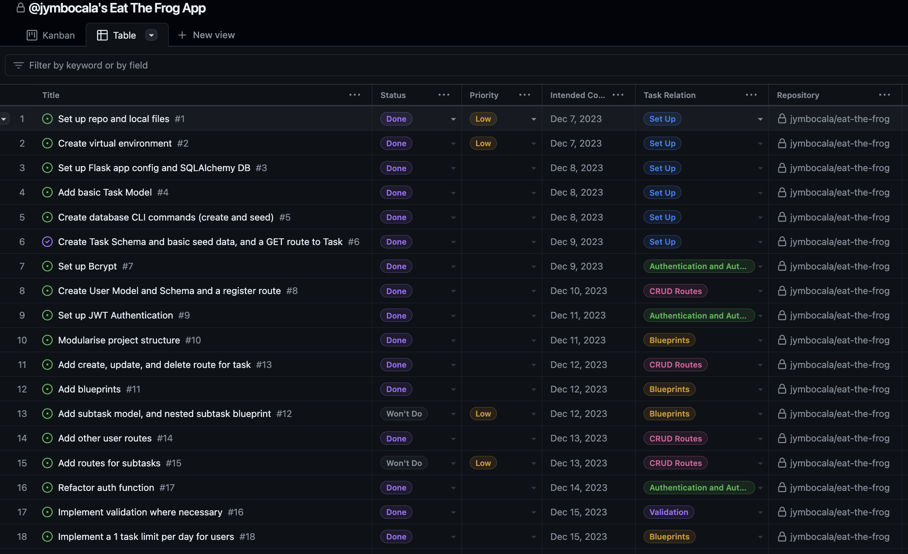
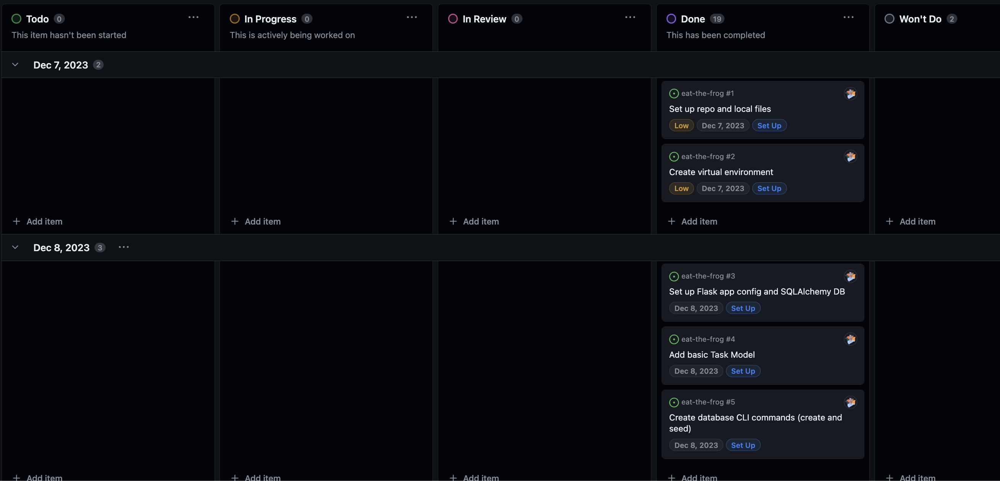
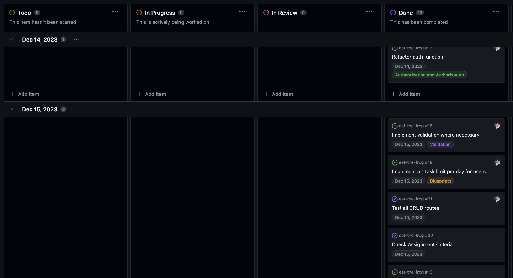

#### Daily stand-ups

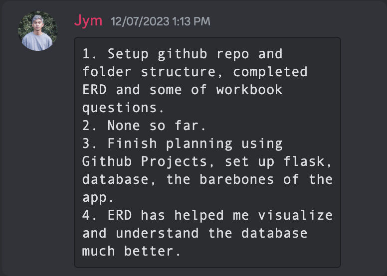
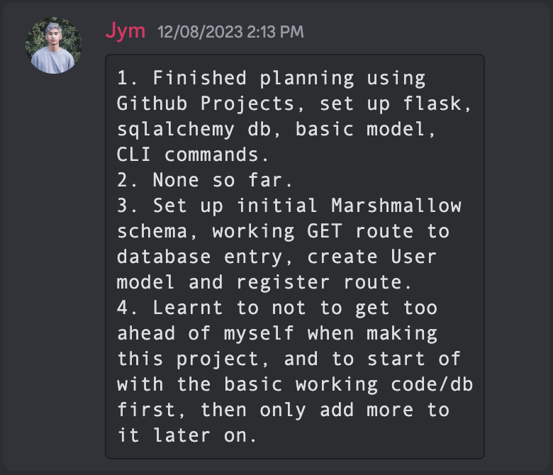
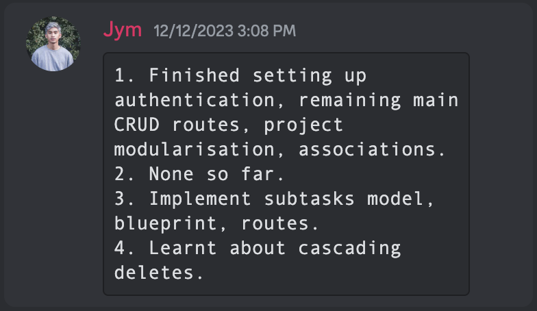
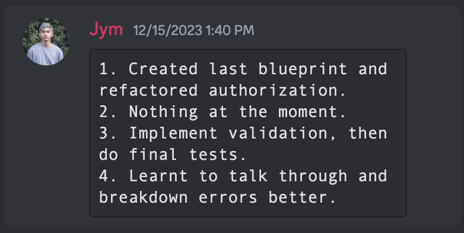

#### GitHub Repo Commits

Commits to the GitHub repository showcase the progression of tasks.

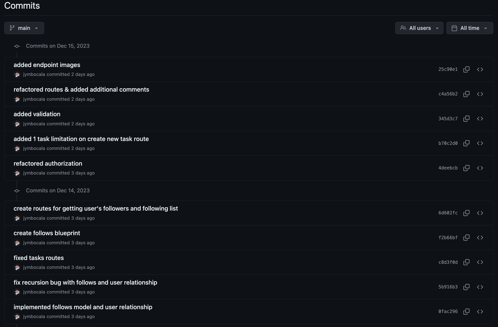
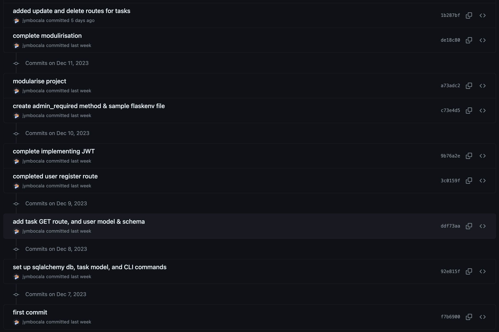
